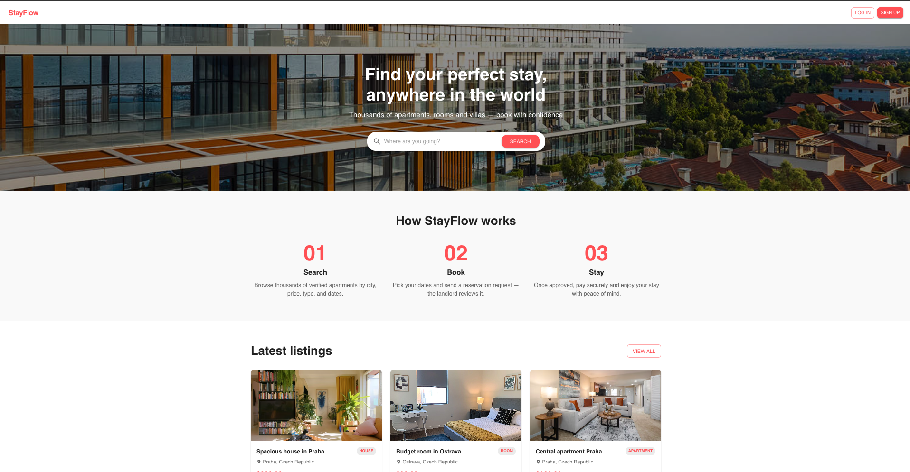
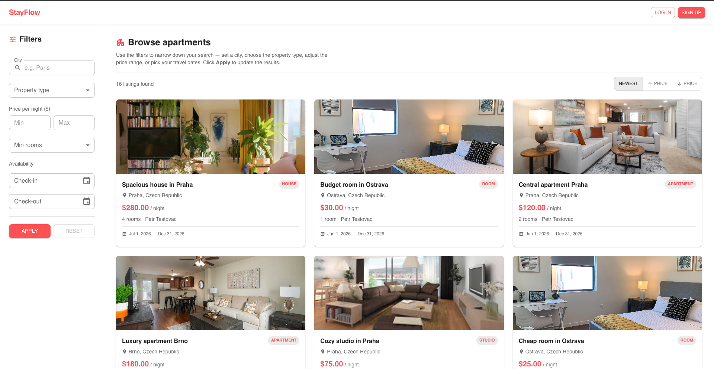
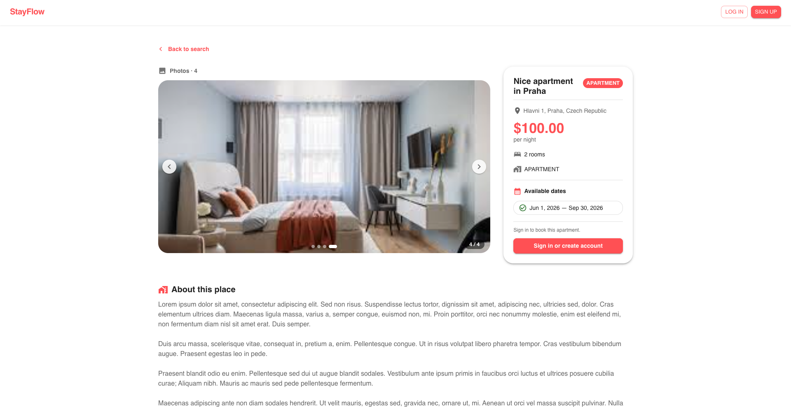
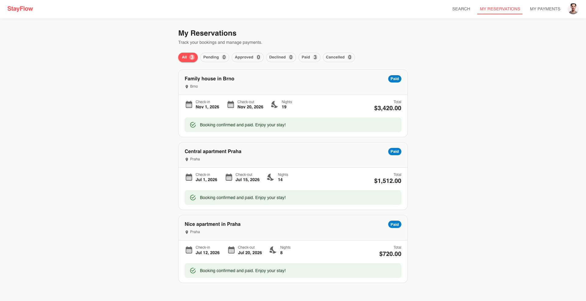
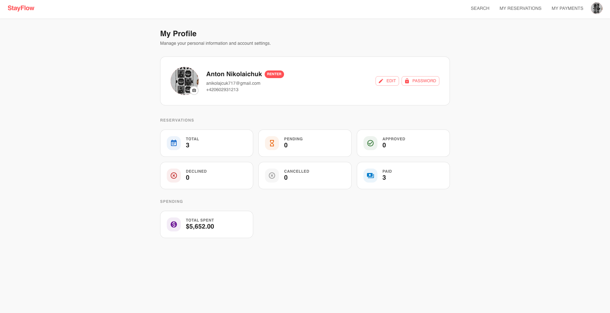
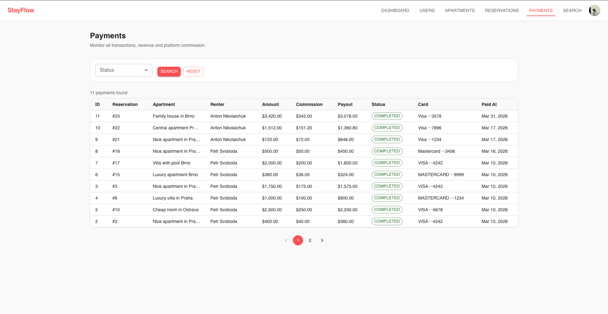

# StayFlow

StayFlow is a web application for short-term apartment rentals. Landlords can list and manage their properties, set availability windows, and approve reservations. Renters can search for apartments, make reservations, and process payments. Administrators have full oversight of the system through a dashboard with statistics.

<table>
  <tr>
    <td></td>
    <td></td>
  </tr>
  <tr>
    <td></td>
    <td></td>
  </tr>
  <tr>
    <td></td>
    <td></td>
  </tr>
</table>

---

## Running Locally

### Prerequisites

- Docker & Docker Compose

### Environment Configuration

Create a `.env` file in the root directory:

```bash
# Database
DB_URL=jdbc:postgresql://localhost:5432/stayflow
DB_USER=stayflow
DB_PASSWORD=stayflow
DB_TEST_URL=jdbc:postgresql://localhost:5433/stayflow_test

# JWT
JWT_SECRET=<your-base64-secret>

# Admin account (created automatically on startup)
ADMIN_EMAIL=admin@stayflow.com
ADMIN_PASSWORD=admin123

# Email (SMTP)
MAIL_HOST=smtp.gmail.com
MAIL_USERNAME=<email>
MAIL_PASSWORD=<password>

# Cloudinary (image storage)
CLOUD_NAME=<cloud_name>
CLOUD_API_KEY=<api_key>
CLOUD_API_SECRET=<api_secret>

# Frontend
NEXT_PUBLIC_API_URL=http://localhost:8080
```

### Start the Application

```bash
docker compose up --build
```

The application will be available at:

- Frontend: `http://localhost:3000`
- Backend API: `http://localhost:8080`

---

## Architecture

### Communication Between Layers

```
┌─────────────────────────────────────────────────────────────┐
│                         Browser                             │
│              Next.js 16 / React 19 / TypeScript             │
│         Axios → REST HTTP/JSON (Bearer JWT token)           │
└─────────────────────────┬───────────────────────────────────┘
                          │ HTTP/JSON  :8080
┌─────────────────────────▼───────────────────────────────────┐
│                        Backend                              │
│              Spring Boot 4 / Java 17                        │
│   Spring Security (JWT) → Controller → Service → Repository │
│                    │                        │               │
│             SMTP (email)            Cloudinary API          │
│           JavaMailSender             (photos)               │
└─────────────────────────┬───────────────────────────────────┘
                          │ JDBC / JPA (Hibernate)  :5432
┌─────────────────────────▼───────────────────────────────────┐
│                      PostgreSQL 15                          │
│              Schema managed by Flyway migrations            │
└─────────────────────────────────────────────────────────────┘
```

### Backend (Spring Boot 4 / Java 17)

```
src/main/java/com/stayflow/backend
├── web/                        # Presentation layer
│   ├── controller/             # REST controllers (@RestController)
│   └── dto/                    # Request and Response objects
├── domain/                     # Domain layer
│   ├── user/                   # Entity, service, repository, exceptions
│   ├── apartment/              # Entity, service, repository, exceptions
│   ├── reservation/            # Entity, service, repository, exceptions
│   └── payment/                # Entity, service, repository, exceptions
└── infrastructure/             # Infrastructure layer
    ├── security/               # JWT filter, Spring Security configuration
    ├── config/                 # Application configuration (Cloudinary, Mail)
    ├── storage/                # Cloudinary adapter (image uploads)
    └── email/                  # JavaMailSender adapter (email sending)
```

| Layer                     | Responsibility                                                        |
| ------------------------- | --------------------------------------------------------------------- |
| `web/controller`          | Handle HTTP requests, map DTOs, call services, return responses       |
| `domain/*/service`        | Business logic, rule validation, repository orchestration             |
| `domain/*/repository`     | Database access via Spring Data JPA                                   |
| `infrastructure/security` | JWT authentication, Spring Security filters, RBAC                     |
| `infrastructure/storage`  | Cloudinary API communication                                          |
| `infrastructure/email`    | Transactional email sending via SMTP                                  |

Database: **PostgreSQL 15**, schema managed by **Flyway** migrations (V1–V5). ORM: **Hibernate** with `ddl-auto: validate`.

### Frontend (Next.js 16 / React 19 / TypeScript)

```
frontend/src
├── pages/          # Next.js file-based routing
├── screens/        # UI components organized by role (guest, renter, landlord, admin)
├── domains/        # TypeScript types and API adapters
├── contexts/       # AuthContext, SnackbarContext
└── utils/          # Helper functions
```

**Public pages**

| URL                | Screen            | Description                                                                                        |
| ------------------ | ----------------- | -------------------------------------------------------------------------------------------------- |
| `/`                | `Home`            | Landing page with hero section, city search, featured apartment listings and feature highlights    |
| `/search`          | `Search`          | Apartment search with filters (city, type, price, rooms, dates), sorting and pagination            |
| `/apartments/[id]` | `ApartmentDetail` | Apartment detail with photo gallery, description, pricing card, availability and booking form      |
| `/auth/login`      | `Login`           | Login form (email + password)                                                                      |
| `/auth/register`   | `Register`        | Account registration with role selection (Landlord / Renter), name, email, phone and password      |
| `/auth/verify`     | `VerifyEmail`     | 6-digit email verification code submission                                                         |

**Renter pages** (role `RENTER`)

| URL                     | Screen           | Description                                                         |
| ----------------------- | ---------------- | ------------------------------------------------------------------- |
| `/renter/reservations`  | `MyReservations` | Reservation overview with status filtering and cancellation support |
| `/renter/checkout/[id]` | `Checkout`       | Payment page for an approved reservation                            |
| `/renter/payments`      | `MyPayments`     | Completed payment history                                           |

**Landlord pages** (role `LANDLORD`)

| URL                              | Screen                 | Description                                                              |
| -------------------------------- | ---------------------- | ------------------------------------------------------------------------ |
| `/landlord/apartments`           | `MyApartments`         | Apartment management with status filtering and activate/deactivate       |
| `/landlord/apartments/new`       | `ApartmentForm`        | Form to create a new apartment listing                                   |
| `/landlord/apartments/[id]/edit` | `ApartmentForm`        | Edit apartment including availability windows and photo management       |
| `/landlord/reservations`         | `IncomingReservations` | Incoming booking requests with approve/decline and optional message      |
| `/landlord/payments`             | `Payments`             | Payment history received from renters                                    |

**Admin pages** (role `ADMIN`)

| URL                   | Screen         | Description                                                                  |
| --------------------- | -------------- | ---------------------------------------------------------------------------- |
| `/admin/dashboard`    | `Dashboard`    | System statistics overview (users, apartments, reservations, payments)       |
| `/admin/users`        | `Users`        | All users table with filtering and delete functionality                      |
| `/admin/apartments`   | `Apartments`   | All apartments table with filtering by city and status                       |
| `/admin/reservations` | `Reservations` | All reservations table with status filtering                                 |
| `/admin/payments`     | `Payments`     | All payments table with status filtering                                     |

**Shared pages** (all authenticated roles)

| URL        | Screen    | Description                                                                      |
| ---------- | --------- | -------------------------------------------------------------------------------- |
| `/profile` | `Profile` | Profile management: avatar, name, email, phone, password; role-specific stats    |
| `/403`     | —         | Access denied page                                                               |
| `/404`     | —         | Page not found                                                                   |

Route access is controlled by the `RouteGuard` component, which reads state from `AuthContext` and redirects unauthorized users to `/403`.
